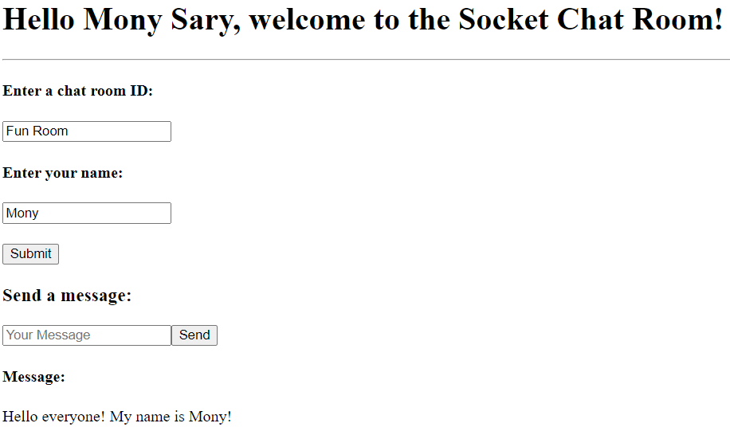
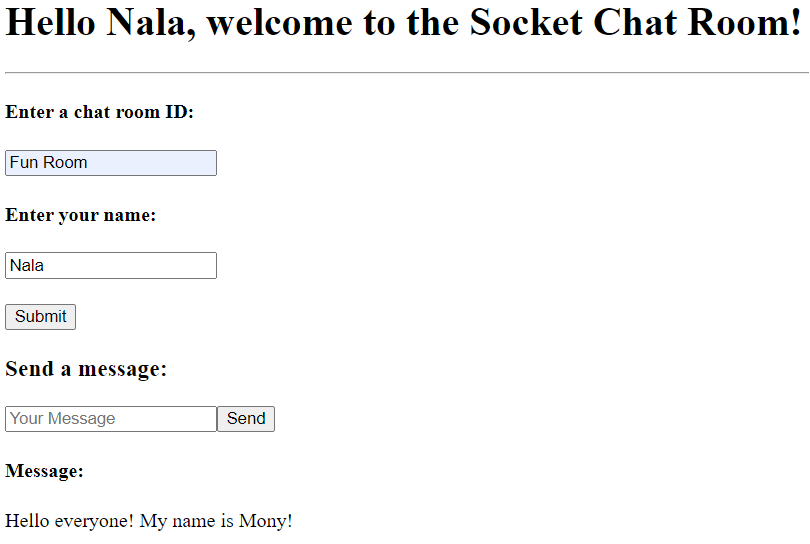

# MERN Stack with Socket.io Template
[](https://opensource.org/licenses/MIT)

## Description
This code was designed for developers who are familiar with the MERN stack but newer to socket.io to use as a template for building web applications that requires those technologies. This template is not meant to be used as is, nor as a tutorial on how to create a MERN/Socket.io web app. It is highly recommended to review documentation of the framework and libraries used in this template for a comprehensive understanding of how each of the framework and libraries work.

## Installation
This template is written in Javascript and uses node.js and MongoDB. Please ensure the correct environments are setup on your machine before continuing.

Clone the repo onto your local machine, and run
`````
npm install
`````
Create a .env file and add in a LOCAL_URI and SECRET process environment. This is important for getting the MERN code to work.

## Usage - Client
This template features a registration and login function which forces users to create an account and log in before they can enter the chat room. The chat room contains a field to enter the name of a chat room and the user's name. After submitting a room name and user's name, they can proceed to chatting with another logged in use that has entered the same chat room.



Chat messages were not designed to persist, but users can modify (as they should) the code to incorporate such features. New chat messages will replace the previous as the two logged in users chat with each other.

All of the socket.io code is contained in the ./client/src/pages/Socket folder. Messages are sent from the client to the server side via the 'sendMessage' event, and received from the server to the client side via the 'receiveMessage' event. The 'joinRoom' event allow for multiple chat rooms to happen at the same time.

## Usage - Server
It is recommended that the ./server/server.js file should not be tampered with as it contains all of the boiler plate code. However, the 'Socket.io main working code' section can be modified to better fit the scope of project. The code is set up to create an open connection between the client and server side, meaning both are listening for specific event so that data can be sent back and forth to all connected users.

## Technologies used
- React
- Node.js
- Express.js
- MongoDB
- Socket.io

## How to contribute
If you'd like to contribute to this template, please contact me at sary.mony@gmail.com and let's collaborate!
